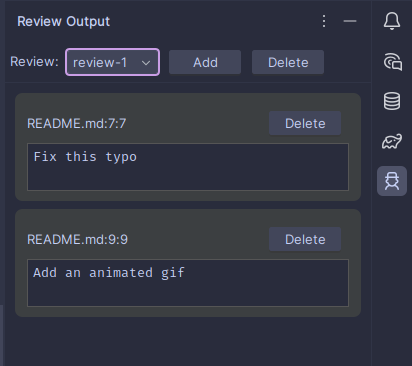
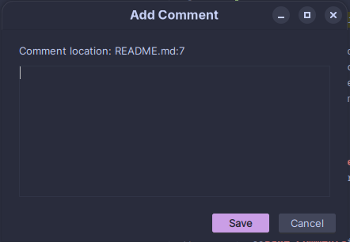
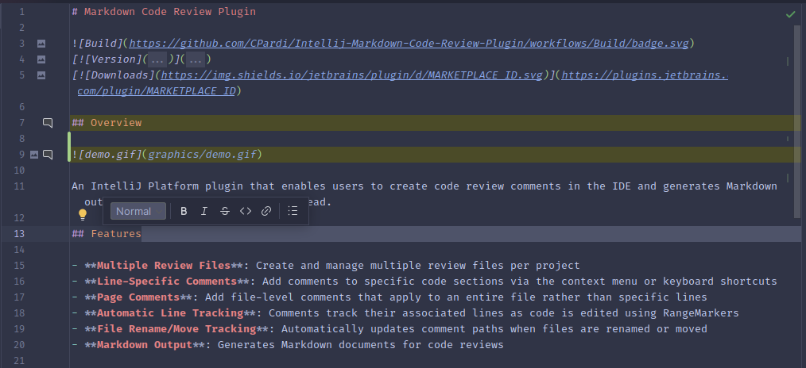

# Markdown Code Review Plugin


[](https://plugins.jetbrains.com/plugin/MARKETPLACE_ID)
[](https://plugins.jetbrains.com/plugin/MARKETPLACE_ID)


An IntelliJ Platform plugin that enables users to create code review comments in the IDE and generates Markdown output for people or AI agents to read.

## Features

- **Multiple Review Files**: Create and manage multiple review files per project
- **Line-Specific Comments**: Add comments to specific code sections via the context menu or keyboard shortcuts
- **Page Comments**: Add file-level comments that apply to an entire file rather than specific lines
- **Automatic Line Tracking**: Comments track their associated lines as code is edited using RangeMarkers
- **File Rename/Move Tracking**: Automatically updates comment paths when files are renamed or moved
- **Markdown Output**: Generates Markdown documents for code reviews

## Usage

### Creating and Managing Reviews



1. Open the **Review Output** tool window (right sidebar)
2. Use the toolbar to create a new review or select an existing one
3. Select `<None>` to deselect the current review and remove all line highlights

_A new review will be created automatically if you add a comment when no review is active._

### Adding Line Comments



Line comments attach to specific lines of code and track the text as it moves during editing.

- **Context Menu**: Right-click in the editor → **Review** → **Add Comment**
- **Keyboard Shortcut**: Ctrl+Alt+K then J

Example line comment output:

```markdown
@[src/main.kt:10:15]:
This function could be refactored into smaller methods
---
```

### Adding Page Comments

Page comments apply to an entire file rather than specific lines and don't track line numbers. These may be added using the methods below.

- **Context Menu**: Right-click in the editor → **Review** → **Add Page Comment**
- **Keyboard Shortcut**: Ctrl+Alt+K then L

Example page comment output:

```markdown
@[src/main.kt:]:
This file needs better documentation
---
```

### Editing Comments



Existing comments are visible from their line highlighting and gutter icon. Comments may be edited using the methods below.

- **Gutter Icon**: Click the gutter icon on any line with an existing comment to edit it
- **Keyboard Shortcut**: Place the cursor on a line with a comment and type Ctrl+Alt+K then K
- **Tool Window**: Select a comment in the **Review Output** tool window and click **Edit**

### Deleting Comments

- **Gutter Icon**: Click the gutter icon on the comment's line, then click **Delete**
- **Edit Comment Dialog**: A delete button is available in the edit comment dialog
- **Tool Window**: Select a comment in the **Review Output** tool window and click **Delete**

## Review File Format

Reviews are stored as Markdown files in a configurable directory (default: `reviews/`). The file format is regular Markdown in the format shown in the example below.

```markdown
@[README.md]:
Overall this is a good first draft
---
@[README.md:23:23]:
Typo in shortcut
---
@[README.md:25:27]:
Move this line to the next paragraph
---
```

## Installation

- Using the IDE built-in plugin system:

  <kbd>Settings/Preferences</kbd> > <kbd>Plugins</kbd> > <kbd>Marketplace</kbd> > <kbd>Search for "Markdown Code Review"</kbd> >
  <kbd>Install</kbd>

- Using JetBrains Marketplace:

  Go to [JetBrains Marketplace](https://plugins.jetbrains.com/plugin/MARKETPLACE_ID) and install it by clicking the <kbd>Install to ...</kbd> button in case your IDE is running.

  You can also download the [latest release](https://plugins.jetbrains.com/plugin/MARKETPLACE_ID/versions) from JetBrains Marketplace and install it manually using
  <kbd>Settings/Preferences</kbd> > <kbd>Plugins</kbd> > <kbd>⚙️</kbd> > <kbd>Install plugin from disk...</kbd>

- Manually:

  Download the [latest release](https://github.com/CPardi/Intellij-Markdown-Code-Review-Plugin/releases/latest) and install it manually using
  <kbd>Settings/Preferences</kbd> > <kbd>Plugins</kbd> > <kbd>⚙️</kbd> > <kbd>Install plugin from disk...</kbd>


---
Plugin based on the [IntelliJ Platform Plugin Template][template].

For maintainers releasing a new version, see [RELEASING.md](RELEASING.md).

[template]: https://github.com/JetBrains/intellij-platform-plugin-template
[docs:plugin-description]: https://plugins.jetbrains.com/docs/intellij/plugin-user-experience.html#plugin-description-and-presentation
